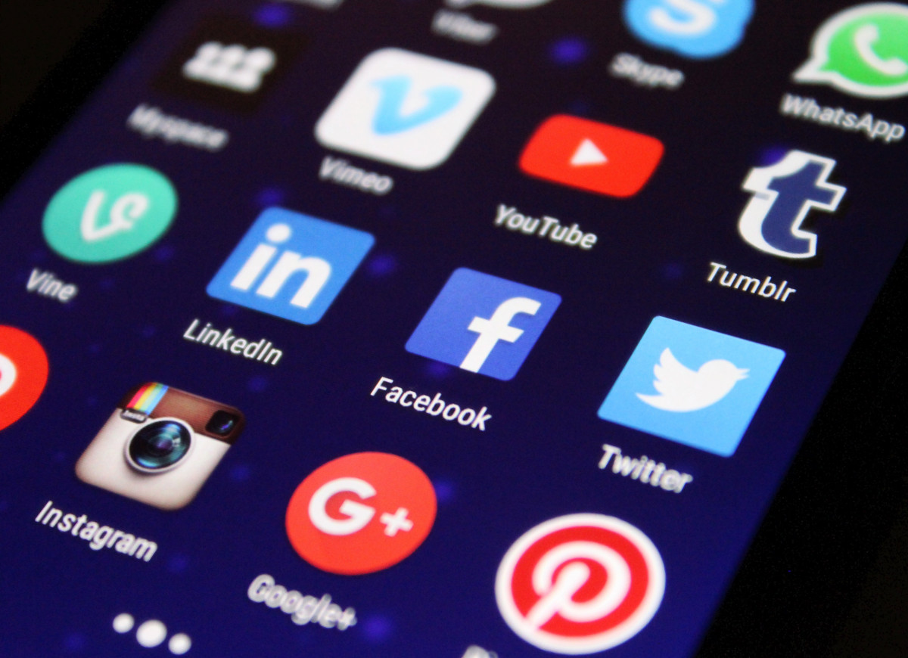

Venho mantendo um longo período de silêncio nas redes sociais, porém hoje presenciei um acontecimento significativo que merece ser compartilhado. Antes de revelar tal ocorrência, gostaria de propor uma reflexão: qual é verdadeiramente o papel e a natureza de uma organização midiática que detém uma concessão governamental para operar um canal televisivo?
Analisando esse cenário, percebemos que o público brasileiro compreende tais empresas como entidades plenamente responsáveis por seu conteúdo transmitido, estando sujeitas a processos judiciais relacionados a qualquer material veiculado em sua programação. Interessante notar que, embora operem sob regime de concessão pública, estas organizações preservam a autonomia para estruturar sua programação e selecionar criteriosamente o conteúdo que será apresentado aos telespectadores, pois monetizam inserções em sua programação.
Esta prerrogativa de determinar a grade de programação e selecionar o conteúdo transmitido acarreta, naturalmente, em responsabilidades legais, tornando estas empresas juridicamente responsáveis por suas escolhas editoriais.
No cenário contemporâneo, as plataformas de mídia social apresentam uma realidade drasticamente distinta daquela existente durante a implementação do Marco Civil da Internet. Podemos ilustrar esta evolução através de duas das principais plataformas atuais: YouTube e TikTok. Nestas redes, a distribuição de conteúdo é predominantemente controlada por sofisticados algoritmos de Inteligência Artificial, programados especificamente para identificar e promover conteúdos que maximizem o engajamento dos usuários e maximizando a sua monetização.
É fundamental compreender a distinção crucial: enquanto as emissoras tradicionais de televisão empregam profissionais qualificados - editores e diretores - para curar e organizar sua programação, as plataformas digitais contemporâneas utilizam sistemas algorítmicos meticulosamente desenvolvidos. Estes algoritmos, longe de serem aleatórios, são estrategicamente projetados para selecionar e promover conteúdos que mantenham os usuários conectados e engajados pelo máximo tempo possível na plataforma.
Nesse contexto, a formação de maioria no STF para responsabilizar as mídias sociais em diversos casos é um passo fundamental para uma sociedade sadia.
