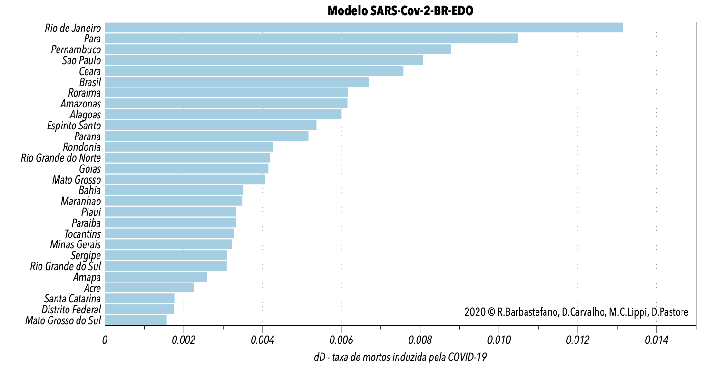

# Nas seções abaixo são apresentadas tópicos sobre o diário de pesquisa.

## Dia 17 de julho de 2020

De posse dos dados do Ministério da Saúde com diversos atributos dos pacientes testados com suspeita de COVID-19, fizemos uma verificação de alguns casos conhecidos para entender como os casos se apresentavam na base.

A verificação foi feita com a comparação de casos conhecidos. Por exemplo, procuramos a data de nascimento do presidente da república na base e tentamos encontrar algum paciente com diagnóstico positivo através do PCR em alguma data em torno da data real do exame. Nos três primeiros casos que procuramos, nós não encontramos correspondentes.

Como a base também apresenta pacientes com teste negativo, fizemos o mesmo procedimento com alguns exames negativos e também não encontramos nenhum deles na base.

Mesmo não tendo a expectativa de se encontrar um exame negativo na base, ficamos preocupados com a inexistência dos testes positivos que deveriam pertencer a base de dados do Ministério da Saúde, pois a notificação é obrigatória.

Com esse pano de fundo, fizemos a seguinte pergunta: qual seria a curva de notificação (casos diagnosticados) se levássemos em consideração a curva de óbitos. Ou seja, qual seria a curva de casos acumulados compatível com a curva de óbitos que temos. Essa pergunta se baseia na premissa que por causa da burocracia própria que existe na ocorrência do óbito, a notificação compulsória do óbito teria maior chance de acontecer.

Na figura abaixo, nós apresentamos dados do Ministério da Saúde, onde os óbitos acumulados no Rio de Janeiro estão marcados em em preto no gráfico e os casos diagnosticados acumulados em azul. Já a curva laranja mostra a estimativa do casos acumulados diagnosticados que teríamos no RJ quando utilizamos o nosso modelo da COVID-19. Nessa curva temos um indicativo que chegamos na quantidade de casos que temos hoje (2020/07/17) há 49 dias e que a escalada de casos foi muito mais íngrime do que mostrariam os dados.

 e resultado do modelo SARS-Cov-2-EDO-BR com previsão de 7 dias.")

Além disso, ficamos consternados com a decisão da Prefeitura Municipal do Rio de Janeiro em mudar a forma de contagem de óbitos na cidade. Felizmente, na manhã de hoje (28 de maio de 2020), recebemos a notícial que a Defensoria Pública conseguiu que a prefeitura revesse a sua posição. Essa decisão era preocupante, pois como podemos observar no gráfico abaixo, o Estado do Rio de Janeiro apresenta a maior taxa de conversão em óibtos induzida pela COVID-19 e o município do Rio tem grande peso nos óbtitos contabilizados.

A taxa de conversão em óbitos induzida pela COVID-19 nos diagnosticados indica a velocidade que o grupo de diagnosticados vão a óbito e serve para avaliar os efeitos de políticas desenvolvidas por agentes públicos, principalmente no Brasil onde se testa menos que 0,5% da população. Por causa disso, os modelos matemáticos podem ser uma das únicas ferramentas disponíveis para se avaliar o resultado das ações governamentais.