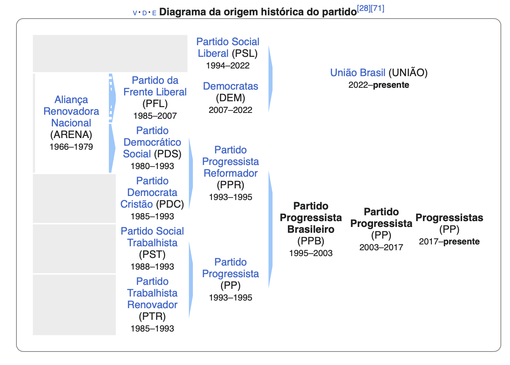
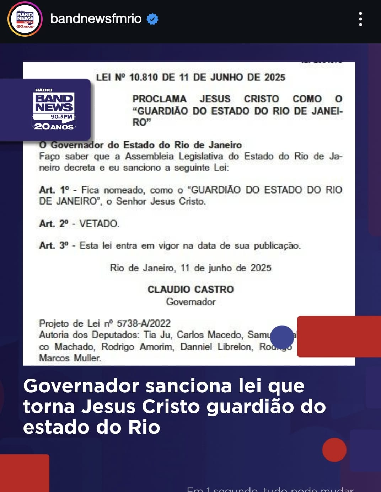

Recentemente, testemunhamos uma reveladora manifestação política quando o Senador Ciro Nogueira apresentou o programa do Progressistas, oferecendo um panorama esclarecedor sobre a metamorfose ideológica da direita brasileira no contexto pós-bolsonarista.

Para uma análise mais aprofundada, é imperativo examinar a evolução histórica do Progressistas, agremiação partidária que consistentemente manteve uma posição proeminente no cenário conservador nacional. Sua relevância institucional manifestou-se em momentos cruciais, como na presidência da Câmara dos Deputados sob Severino Cavalcante, aquele que queria a diretoria que fura poços, além de ter abrigado personalidades emblemáticas como Paulo Maluf. Significativamente, toda a estrutura política conservadora contemporânea encontra suas raízes na ARENA (Aliança Renovadora Nacional), instrumento político-partidário que vendeu sustentação ao regime militar brasileiro.

O fenômeno bolsonarista inaugurou uma profunda reconfiguração nas prioridades tradicionalmente defendidas pelo espectro direitista. Evidencia-se uma acentuada priorização de pautas de costume, selecionadas meticulosamente por sua capacidade de polarização e compreensão simplificada pelo eleitorado. Este processo reflete notavelmente a experiência norte-americana, onde o Partido Republicano experimentou uma substancial influência dos movimentos neopentecostais. Em território brasileiro, a ascendente participação política destes segmentos religiosos acelerou uma transformação análoga. Consequentemente, debates complexos, como a questão do aborto, são reduzidos a antagonismos simplistas: protetores da vida versus promotores da morte.

Concomitantemente às questões morais maniqueístas, observa-se uma apropriação estratégica da temática da segurança pública pela direita brasileira, especialmente relevante nos grandes centros urbanos. Entretanto, quando assumem responsabilidades executivas, estas forças políticas demonstram uma notória insuficiência administrativa, substituindo políticas públicas estruturadas por intervenções improvisadas e autoritárias. A materialização mais emblemática desta fusão entre fundamentalismo religioso e incompetência administrativa encontra-se na controversa legislação do Rio de Janeiro, que institui Jesus Cristo como Guardião oficial do Estado.

Particularmente alarmante é a extraordinária capacidade de disseminação que esta combinação de ineficiência governamental e populismo encontra no ecossistema das redes sociais, enquanto significativa parcela da população permanece aparentemente insensível aos riscos inerentes a este processo. Persiste a expectativa de que o tecido social brasileiro desenvolva rapidamente anticorpos contra esta armadilha político-ideológica, antes que suas consequências se tornem irreversíveis para nossa democracia, como estamos assistindo exatamente nesse momento nos Estados Unidos.

Esta conjuntura demanda uma reflexão profunda sobre os rumos da política nacional e a necessidade urgente de um debate mais qualificado sobre políticas públicas efetivas, em detrimento de retóricas simplistas e soluções superficiais que apenas mascaram problemas estruturais de nossa sociedade.
