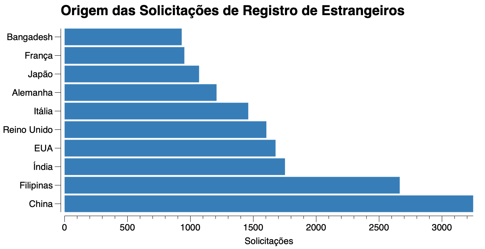

Ocorreu um aumento nos pedidos de autorização de residência de estrangeiros para trabalho e investimento no Brasil, no fim de junho como podemos ver no gráfico abaixo que apresenta só os dados do primeiro semestre. Isso pode ser um indicativo que a economia está se tornando atrativa para os investidores estrangeiros.

Olhando os dados do ano passado inteiro, onde tivemos 29.627 registros, os principais destinos de trabalho dos imigrantes foram os estados do Rio de Janeiro (11.924) e São Paulo (10.657), que juntos representam 76,2% do total. Na sequência vieram Paraná (1.622), Minas Gerais (1.247), Bahia (819), Santa Catarina (556), Amazonas (415), Ceará (336), Distrito Federal (325) e Rio Grande do Sul (298). Já a origem dos imigrantes é mostrada no gráfico abaixo.

